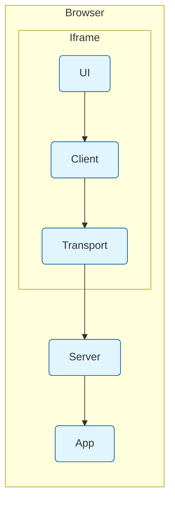

# BrowserContextTransport

Enables communication between different browser contexts using the MessageChannel API.

## Motivation

When building agentic chat applications in the browser with MCP, you need a reliable way for components to communicate across browser security boundaries. For example:

- Chat UI running in a sandboxed iframe needs to talk to MCP clients/servers
- Agent tools executing in web workers need to communicate with the main thread
- Security-sensitive components isolated in separate contexts need to exchange messages

Other transports don't work well for these browser scenarios:
- **InMemoryTransport**: Can't cross browser context boundaries (iframes, workers)
- **WebSocketTransport**: Requires network connection, server infrastructure, and adds latency
- **SSETransport**: Limited to one-way communication, requires network connection

## Use Case



## Quick Start

### Creating a Transport Pair

Most basic use case - both ends in same context:

```typescript
const [clientTransport, serverTransport] = BrowserContextTransport.createChannelPair();
const client = new Client(clientTransport);
const server = new Server(serverTransport);
```

### With Iframes

Special code is needed for iframes because they're separate JavaScript execution contexts with their own memory space. You must use `postMessage` to transfer a `MessagePort`:

```typescript
// Parent window
const iframe = document.getElementById('myIframe');
const channel = new MessageChannel();
const clientTransport = new BrowserContextTransport(channel.port1);
const client = new Client(clientTransport);
iframe.contentWindow.postMessage('init', '*', [channel.port2]);

// Inside iframe
window.addEventListener('message', (event) => {
  if (event.data === 'init' && event.ports[0]) {
    const serverTransport = new BrowserContextTransport(event.ports[0]);
    const server = new Server(serverTransport);
  }
});
```

### With Workers

Workers also require special handling since they run in isolated threads. Like iframes, they need a `MessagePort` transferred via `postMessage`:

```typescript
// Main thread
const worker = new Worker('worker.js');
const channel = new MessageChannel();
const clientTransport = new BrowserContextTransport(channel.port1);
worker.postMessage('init', [channel.port2]);

// In worker
self.addEventListener('message', (event) => {
  if (event.data === 'init') {
    const serverTransport = new BrowserContextTransport(event.ports[0]);
    const server = new Server(serverTransport);
  }
});
``` 